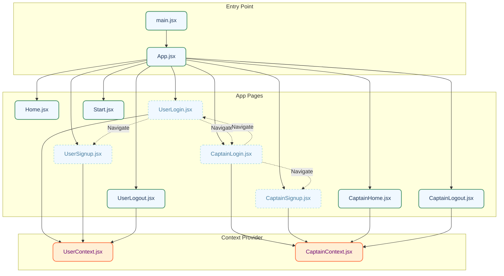

# UBER Client Application Documentation

## Pages Overview

### 1. Home Page (`/home`)

- **File**: `src/pages/Home.jsx`
- **Description**: The home page for users after they log in.
- **Components**:
  - Placeholder text "Home adsad"

### 2. User Signup Page (`/signup`)

- **File**: `src/pages/UserSignup.jsx`
- **Description**: Allows new users to create an account by providing their first name, last name, email, and password.
- **Components**:
  - Background image with white overlay
  - Signup form with fields for first name, last name, email, and password
  - "Create Account" button
  - Link to the login page for existing users

### 3. User Login Page (`/login`)

- **File**: `src/pages/UserLogin.jsx`
- **Description**: Allows existing users to log in by providing their email and password.
- **Components**:
  - Background image with white overlay
  - Login form with fields for email and password
  - "Login" button
  - Link to the signup page for new users
  - Link to the captain login page

### 4. User Logout Page (`/user/logout`)

- **File**: `src/pages/UserLogout.jsx`
- **Description**: Logs out the user and redirects to the login page.
- **Components**:
  - Placeholder text "UserLogout"

### 5. User Protect Wrapper

- **File**: `src/pages/UserProtectWrapper.jsx`
- **Description**: A higher-order component that protects routes meant for users. It checks if the user is authenticated and redirects to the login page if not.
- **Components**:
  - Loading state while checking authentication
  - Renders children components if authenticated

### 6. Captain Signup Page (`/captain-signup`)

- **File**: `src/pages/CaptainSignup.jsx`
- **Description**: Allows new captains to create an account by providing their first name, last name, email, password, and vehicle details.
- **Components**:
  - Background image with white overlay
  - Signup form with fields for first name, last name, email, password, vehicle color, vehicle plate, vehicle capacity, and vehicle type
  - "Sign Up" button
  - Link to the captain login page for existing captains

### 7. Captain Login Page (`/captain-login`)

- **File**: `src/pages/CaptainLogin.jsx`
- **Description**: Allows existing captains to log in by providing their email and password.
- **Components**:
  - Background image with white overlay
  - Login form with fields for email and password
  - "Login" button
  - Link to the captain signup page for new captains
  - Link to the user login page

### 8. Captain Home Page (`/captain-home`)

- **File**: `src/pages/CaptainHome.jsx`
- **Description**: The home page for captains after they log in.
- **Components**:
  - Placeholder text "CaptainHome"

### 9. Captain Logout Page (`/captain/logout`)

- **File**: `src/pages/CaptainLogout.jsx`
- **Description**: Logs out the captain and redirects to the captain login page.
- **Components**:
  - Placeholder text "CaptainLogout"

### 10. Captain Protect Wrapper

- **File**: `src/pages/CaptainProtectWrapper.jsx`
- **Description**: A higher-order component that protects routes meant for captains. It checks if the captain is authenticated and redirects to the login page if not.
- **Components**:
  - Loading state while checking authentication
  - Renders children components if authenticated

### 11. Start Page (`/`)

- **File**: `src/pages/Start.jsx`
- **Description**: The landing page of the application. It provides a brief introduction and a "Continue" button that navigates to the login page.
- **Components**:
  - Background image
  - Title "UBER"
  - "Get Started with Uber" section with a "Continue" button

## Context

### User Context

- **File**: `src/context/UserContext.jsx`
- **Description**: Provides user data context to manage user state across the application.
- **Components**:
  - `UserDataContext` for managing user state
  - `UserContext` component to wrap the application and provide context

### Captain Context

- **File**: `src/context/captainContext.jsx`
- **Description**: Provides captain data context to manage captain state across the application.
- **Components**:
  - `CaptainDataContext` for managing captain state
  - `CaptainContext` component to wrap the application and provide context

## Main Application

### App Component

- **File**: `src/App.jsx`
- **Description**: Main application component that defines the routes for the application.
- **Components**:
  - Routes for home, user login, user signup, captain login, captain signup, captain home, user logout, and captain logout pages

### Main Entry Point

- **File**: `src/main.jsx`
- **Description**: Entry point of the application that renders the `App` component within the `UserContext`, `CaptainContext`, and `BrowserRouter`.
- **Components**:
  - `StrictMode` for highlighting potential problems
  - `UserContext` for providing user data context
  - `CaptainContext` for providing captain data context
  - `BrowserRouter` for handling routing
  - `App` component containing the main routes

## Diagrammatic View

